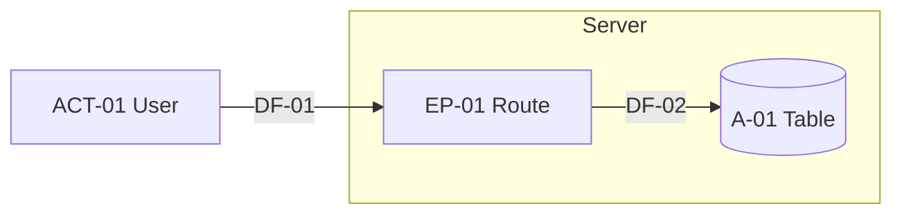

# Threat Model Template

Use this template for every FULL threat model required by a Pro edition requirement in [GOVERNANCE.md](../GOVERNANCE.md). Write the model before major architecture work or a security sensitive feature is implemented, and revisit it when the design changes. A model written after the code exists is still useful, but mark it RETROSPECTIVE in the header.

Save each model in the project as `docs/security/threat-models/YYYY-MM-DD-<slug>.md`. The `/hullproof-threat-model` skill (Hullproof Pro) drafts one from this template. If the feature calls a model, uses tools, retrieval or agent memory, also complete [AI-THREAT-MODEL.md](AI-THREAT-MODEL.md) in the same file.

Requirement IDs in this template that have no entry in your `docs/hullproof` folder are Hullproof Pro requirements; cite them by ID as written.

Rules for whoever fills it in, person or agent:

1. **Never invent facts about the system.** Every fact comes from code (cite `file:line`), from the owner (name and date), or is marked `ASSUMPTION:`. Anything unknown goes in Open questions.
2. **Fill every section.** If a section has nothing in it, write "None, because ..." so a reader can tell an empty answer from a skipped one.
3. **No arbitrary numeric scores.** Likelihood and impact use a qualitative label (Low, Medium, High) with a written rationale. A numeric score (CVSS, DREAD, a 1 to 5 scale, likelihood times impact) is allowed only when the inputs that justify it are recorded next to it, for example a CVSS vector for a known CVE or attempt rates measured from logs.
4. **Controls reference SEC IDs.** Name the Hullproof requirement each control satisfies. Prompt wording, hidden UI and client side checks are never controls (HULLPROOF.md hard rule 3, AI-SECURITY.md).
5. **Use IDs consistently** so threats can point back to the system map: assets `A-01`, actors `ACT-01`, entry points `EP-01`, trust boundaries `TB-01`, data flows `DF-01`, external systems `EXT-01`, abuse cases `AB-01`, threats `TM-01`. Never reuse a retired ID.

````markdown
# Threat Model: [Feature or system name]

| Field | Value |
|-------|-------|
| Scope | What is modeled, in one or two sentences |
| In scope | Components, routes, tables, services covered |
| Out of scope | What is deliberately excluded and why |
| Model type | FULL (a Pro edition requirement) |
| Timing | BEFORE IMPLEMENTATION, or RETROSPECTIVE (code already exists) |
| Version | 1.0, raised on every material change |
| Commit SHA | Full SHA the model was drawn against, or "design only, no code yet" |
| Author | Person or agent that drafted it |
| Date | YYYY-MM-DD |
| Project stage | LAUNCH, GROWTH or SCALE (a Pro edition requirement) |
| AI extension | YES (AI-THREAT-MODEL.md sections included) or NO |
| Status | PROPOSED, REVIEWED or SUPERSEDED |
| Review trigger | Written before major architecture or security sensitive features. Revisit when the design changes, after an incident or finding that shows a missed threat (a Pro edition requirement), and at least once per release that touches this scope. |

## What are we working on?

### 1. Assets

What an attacker wants or what the business cannot lose: data, money, credentials, tenant boundaries, availability, spend.

| ID | Asset | Where it lives | Sensitivity | Source |
|----|-------|----------------|-------------|--------|
| A-01 | | Table, bucket, service, secret store | Personal data, credentials, money, tenant data, availability or cost | file:line, owner, or ASSUMPTION |

### 2. Actors

Everyone who touches the system, honest or not, including internal services and coding agents.

| ID | Actor | Trust level | Legitimate access | What they could want |
|----|-------|-------------|-------------------|----------------------|
| ACT-01 | | Anonymous, authenticated user, other tenant, admin, internal service, third party, coding agent | | |

### 3. Entry points

Every place input enters: public routes, Server Actions, webhooks, Data API tables, storage buckets, mobile screens calling the backend, jobs, model calls.

| ID | Entry point | Location | Reachable by | Authentication | Input accepted |
|----|-------------|----------|--------------|----------------|----------------|
| EP-01 | | file:line or planned path | ACT IDs | None, session, API key, signature | |

### 4. Trust boundaries

Where data or control passes between zones of different trust. Each boundary needs a control that enforces it on the higher trust side.

| ID | Boundary | From (lower trust) | To (higher trust) | Enforced by | Source |
|----|----------|--------------------|-------------------|-------------|--------|
| TB-01 | | | | Control and location, or "none found" | |

### 5. Data flows

Draw the diagram in Mermaid so it can be diffed. Mark trust boundaries as subgraphs. Every arrow in the diagram has a row in the table.



| ID | From | To | Data | Crosses boundary | Validation and protection |
|----|------|----|------|------------------|---------------------------|
| DF-01 | | | | TB ID or no | Schema, TLS, signature, authorization check |

### 6. Privileges

What each principal can actually do compared with what it needs. Include user roles, service roles, database roles, API keys, CI tokens and agent tool credentials.

| Principal | Can do | Needs to do | Granted where | Gap |
|-----------|--------|-------------|---------------|-----|
| | | | file:line or console setting | Excess privilege, or none |

### 7. External systems

Third party services, providers and APIs. Data received from them is untrusted input.

| ID | System | Purpose | Data sent | Data received | Credential and scope | If it fails or is compromised |
|----|--------|---------|-----------|---------------|----------------------|-------------------------------|
| EXT-01 | | | | | Key name (never the value), scope | Fails open or closed, blast radius |

## What can go wrong?

### 8. Abuse cases

Legitimate features used harmfully, usually at volume: signup, invites, referrals, coupons, trials, messaging, exports, AI generation (a Pro edition requirement). Also list resource heavy functions and their limits (a Pro edition requirement).

| ID | Flow | Abuse | Limit per user | Global limit | Enforced where | SEC ID |
|----|------|-------|----------------|--------------|----------------|--------|
| AB-01 | | What happens if it runs ten thousand times | | | Server location, or "missing" | |

### STRIDE walk

STRIDE is a prompt list for finding threats, not a score. Walk it per element as a Pro edition requirement sets out: all six categories for processes; tampering, information disclosure and denial of service for data flows and data stores (plus repudiation for audit logs); spoofing and repudiation for external entities.

| Element | Type | Categories walked | Threats found | Categories ruled out, and why |
|---------|------|-------------------|---------------|-------------------------------|
| EP-01 | Process, data flow, data store or external entity | S T R I D E | TM IDs | |

### 9. Threats

One block per threat, numbered TM-01, TM-02 and so on. Exactly these eleven fields.

#### TM-01: [Short title]

| Field | Value |
|-------|-------|
| Threat ID | TM-01 |
| Asset | A IDs at risk |
| Threat actor | ACT ID and what they control |
| Attack path | Step by step from entry point to asset, naming EP, TB and DF IDs, with the STRIDE category in brackets |
| Preconditions | What must be true first: an account, a leaked key, a missing check, a specific role |
| Impact | What happens to the asset and the business, then a label: Low, Medium or High |
| Likelihood rationale | Label (Low, Medium or High) and why: attacker effort, skill, exposure, existing friction. Numbers only with recorded inputs |
| Existing controls | SEC IDs already met, each with `file:line` evidence and VERIFIED or SUSPECTED, or "None found" |
| Recommended controls | SEC IDs to implement and the concrete change for this system |
| Residual risk | Response: MITIGATE, ELIMINATE, TRANSFER or ACCEPT. Rank before controls and after recommended controls (HIGH, MEDIUM or LOW, as a judgement from impact and likelihood). If ACCEPT, link the entry in section 11 |
| Verification | The named test or manual check that proves the control works. HIGH rank threats need an automated test that passes before merge (a Pro edition requirement) |

## What are we going to do about it?

### 10. Controls

Every recommended control from section 9 in one list, so it can become tasks.

| Control | SEC ID | Threats addressed | Status | Owner | Test |
|---------|--------|-------------------|--------|-------|------|
| | | TM IDs | EXISTS, PLANNED or MISSING | | Test file or check name |

### 11. Residual risk

Risk that remains after the recommended controls, and every threat answered ACCEPT or TRANSFER. Accepted risks follow the Exceptions and risk acceptance rules in `docs/hullproof/STANDARD.md` and are recorded in the project's security decisions log (a Pro edition requirement). BLOCKER level risk is never accepted. A CRITICAL acceptance needs a named owner, a compensating control and an expiry date; a HIGH acceptance needs an owner and a fix date. An agent never accepts a risk on the owner's behalf: it records the proposal as PENDING.

| Threat ID | Response | Residual rank | Why this is acceptable | Owner | Decisions log entry | Review or expiry date |
|-----------|----------|---------------|------------------------|-------|---------------------|-----------------------|
| | ACCEPT or TRANSFER | | | | Link, or PENDING | |

## Did we do a good enough job?

### Open questions

Unknowns that block a confident answer. A threat that depends on an open question stays open.

| # | Question | Why it matters | Who can answer | Affects |
|---|----------|----------------|----------------|---------|
| 1 | | | | TM or section IDs |

### Review

Required for authentication, payments, multi tenancy and AI tool use (a Pro edition requirement). An agent may act as a second viewpoint but is never recorded as the human reviewer.

| Reviewer | Role | Date | Outcome |
|----------|------|------|---------|
| | | | Approved, approved with changes, or rejected |

### Exit checklist

Ticked by the human owner, not only the agent that drafted the model.

- [ ] The diagram matches the real system, or the planned design if nothing is built yet.
- [ ] Every entry point and trust boundary has a STRIDE walk row.
- [ ] Every threat has all eleven fields and exactly one response.
- [ ] Every mitigation names a SEC ID and a test; tests for HIGH threats exist and pass.
- [ ] Every ACCEPT has a decisions log entry with an owner and a date.
- [ ] The AI extension is complete if the feature uses a model, tools, retrieval or memory (a Pro edition requirement).
- [ ] Open questions are answered or carried as named follow ups.
- [ ] The model is linked from the pull request (a Pro edition requirement).

### Change log

| Date | Version | Change | Reason (design change, incident, finding) |
|------|---------|--------|-------------------------------------------|
| | 1.0 | Initial model | |
````

## Requirements this template serves

a Pro edition requirement (FULL model before merge), a Pro edition requirement (DELTA notes point to this model), a Pro edition requirement (diagram, STRIDE walk, one response per threat, SEC ID and test per mitigation, exit check), a Pro edition requirement (AI section, through AI-THREAT-MODEL.md), a Pro edition requirement (accepted risk record), a Pro edition requirement (abuse cases and limits), a Pro edition requirement (resource heavy functions), a Pro edition requirement (independent review), a Pro edition requirement (refresh after new evidence) and a Pro edition requirement (threat model entry for every AI feature).

## Sources

Structure follows the four key questions of the Threat Modeling Manifesto (SRC-018) and the system modeling, threat identification, response and review steps of the OWASP Threat Modeling Cheat Sheet (SRC-017). The per element STRIDE walk follows Microsoft's STRIDE threat categories for the Threat Modeling Tool (SRC-019). Field layout and wording are Hullproof original. Full source details are in [REFERENCES.md](../REFERENCES.md).
